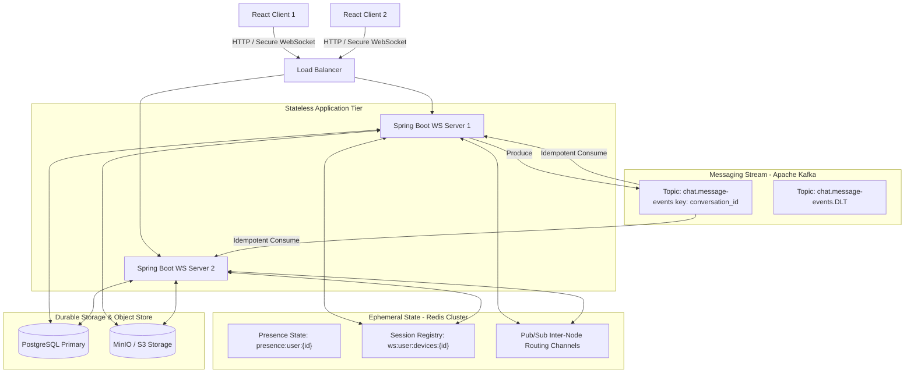

# Scalable Real-Time Distributed Chat Backend

A high-performance, stateless distributed real-time chat backend inspired by WhatsApp's system design. Engineered from the ground up to support horizontal scaling, strong ordering guarantees, idempotent async processing, multi-device sync, and sub-30ms delivery latencies.

---

## 1. System Architecture Spec



### Architectural Slices
* **Edge Layer:** Directs WebSocket traffic and standard REST requests statelessly to any active backend server node.
* **Stateless Gateway Nodes:** Spring Boot instances managing active TCP connections from WebSockets. Nodes hold no local-only user state, making them trivially expandable horizontally.
* **State & Pub/Sub (Redis):** Acts as the high-speed registry mapping `userId` + `deviceId` to specific backend `nodeIds`, while routing cross-instance socket frames via Redis Pub/Sub channels.
* **Asynchronous Backbone (Kafka):** Processes post-ingress messaging, fan-outs, notifications, and delivery receipt pipelines asynchronously without choking connection gateway threads.
* **Durable Storage (PostgreSQL & S3):** Serves as the source of truth. PostgreSQL handles relations (conversations, members, metadata) and transaction-safe lookups. MinIO/S3 handles binary blobs.

---

## 2. Deep-Dive Design Decisions

### 2.1 Modular Monolith vs. Microservice Strategy
Rather than deploying an over-engineered network of 10+ microservices, the system is designed as a **Modular Monolith**. 
* **Benefits:** High transactional consistency, zero-network-hop memory lookups within the same JVM, unified deployments, and simplified development.
* **Extraction Readiness:** Components are partitioned cleanly by boundaries (`com.chat.auth`, `com.chat.presence`, `com.chat.media`, `com.chat.message`). If connection scaling and CPU profiling diverge (e.g., the WebSocket Gateway needs high memory, while the S3 upload service needs high bandwidth), they can be extracted into individual microservices without changing a line of database schema.

### 2.2 Time-Sortable Message IDs (UUIDv7)
Traditional PostgreSQL auto-incrementing integer IDs (`BIGSERIAL`) fail in distributed databases due to write-lock conflicts on central sequence counters across shards.
* **The Solution:** We generate **UUIDv7** identifiers at the application layer.
* **Structure:** The most significant 48 bits contain a Unix millisecond timestamp, followed by random bits for entropy.
* **Performance:** Provides global uniqueness (zero node lock conflicts) while maintaining natural time sorting in B-Tree database indexes ($O(\log N)$ inserts). This prevents index fragmentation and speeds up cursor pagination lookups.

### 2.3 Strict Message Ordering per Conversation
In chat apps, messages must render in the exact order they were sent. In a distributed multi-node deployment, physical clocks (NTP) can drift, meaning server-receive times can arrive out of order.
* **The Solution:**
  1. We key Kafka message productions by `conversation_id`.
  2. This guarantees that **every message sent in a specific chat lands on the exact same Kafka partition**.
  3. Consequently, messages are processed sequentially by a single worker thread per consumer group. Total order is preserved.

### 2.4 At-Least-Once Delivery & Idempotence
Exactly-Once Delivery over a distributed network is theoretically impossible due to network splits during acknowledgments (the Two Generals Problem). We design for **At-Least-Once Processing with Idempotent Consuming**:
* **Database Unique Constraints:** We enforce a database-level unique index on `messages` via `(conversation_id, sender_id, client_message_id)`.
* **Idempotent Upserts:** Receipts use composite key `(message_id, user_id)`. If Kafka redelivers an event due to a transient worker crash, database-level primary constraints handle duplication safely.

### 2.5 Distributed WebSocket Routing (The Routing Envelope Pattern)
If User A is connected to Node 1, and User B is connected to Node 2:
1. Node 1 receives User A's message.
2. Node 1 queries Redis for User B's active devices and nodes.
3. Redis returns that User B is connected on Node 2.
4. Node 1 wraps the message frame along with User B's target `deviceId` in a `NodeRoutingEnvelope` and publishes it to the Redis Pub/Sub channel `channel:node:Node2`.
5. Node 2 receives the envelope, extracts the specific `deviceId`, finds the corresponding open TCP WebSocket session in its local memory map, and pushes the raw frame.

### 2.6 Ephemeral Presence (Heartbeat/TTL)
To avoid throttling PostgreSQL with constant "online/offline" database writes:
* Users send a lightweight ping frame over WebSockets every 15 seconds.
* This updates a Redis key `presence:user:{userId}` with a **30-second TTL**.
* If a user disconnects or loses network, the key naturally expires in Redis. A `PRESENCE_CHANGED(Offline)` event is asynchronously broadcasted, and the database `last_seen` timestamp is updated out-of-band.

### 2.7 S3 Direct-to-Storage Presigned Upload Pattern
Proxying media uploads through a Spring Boot application saturates garbage collection, locks thread pools, and starves network I/O.
* **The Pattern:** 
  1. Client requests an upload token: `POST /api/media/upload-url`.
  2. The server validates size (Max 100MB) and mime-type, then returns an S3 **Presigned PUT URL**.
  3. The client uploads the binary directly to MinIO/S3 using the presigned URL.
  4. The client then sends the metadata (file size, type, download URL) over the WebSocket frame. The application server only handles metadata strings, keeping memory usage flat.

### 2.8 High-Performance Cursor Pagination vs. Offset Pagination
* **Why OFFSET is Bad:** `OFFSET 10000 LIMIT 50` requires the database to scan and discard 10,000 rows before returning the 50 we wanted. Query performance degrades linearly as history grows.
* **Cursor Solution:** We query using the time-sortable UUIDv7 ID: `WHERE conversation_id = :id AND id < :cursor ORDER BY id DESC LIMIT 50`. This utilizes the indexed primary key directly, maintaining consistent sub-millisecond response times regardless of chat history size ($O(1)$ lookup complexity).

---

## 3. Database Schema

All database migrations are handled automatically on startup via **Flyway Migrations**. 

### Critical Table Indexes
* `idx_messages_conversation_id_created_at`: Speeds up conversation history fetching and cursor pagination.
* `idx_conversation_members_user_id`: Optimizes sidebar conversation loading for specific users.
* `idx_unique_client_message_id`: Enforces application-level idempotency to prevent duplicate message sends.

---

## 4. API Specification

### 4.1 Authentication Modules
* `POST /api/auth/register` - Creates a new user profile and registers their first active device.
* `POST /api/auth/login` - Authenticates user credentials and returns JWT Access + Refresh tokens.
* `POST /api/auth/refresh` - Standard session renewal utilizing a secure Refresh Token.

### 4.2 Conversation Management
* `POST /api/conversations/direct` - Starts a direct 1-to-1 conversation with a target user ID.
* `POST /api/conversations/group` - Creates a group chat with multiple user IDs as members.

### 4.3 Message Sync & History Queries
* `GET /api/conversations/{conversationId}/messages?before={cursorId}&limit=50` - High-performance cursor-pagination query.
* `GET /api/messages/sync?afterMessageId={cursorId}` - Executed upon WebSocket reconnection to fetch all missed messages across all active user conversations.

### 4.4 Media Attachments
* `POST /api/media/upload-url` - Requests an S3/MinIO direct upload presigned URL.

### 4.5 User Profiles & Presence
* `GET /api/users/{userId}/presence` - Returns the real-time online/offline presence status of a user.

---

## 5. Local Setup & Operations

### Step 1: Clone the Repository & Start Infrastructure Services
Start PostgreSQL, Redis, ZooKeeper, Kafka, MinIO, Prometheus, and Grafana in the background using Docker Compose:

```bash
docker compose up -d
```

### Step 2: Configure Environment Variables
Copy `.env.example` to `.env` or verify the defaults in `application.yml` match your local environment.

### Step 3: Run flyway database migrations & start backend
Compile and run the Spring Boot application using Maven:

```bash
./mvnw clean spring-boot:run
```

The server will launch on port **`8080`**.

---

## 6. Observability Specs (Actuator, Prometheus & Grafana)

The backend exposes metrics at `/actuator/prometheus` using **Micrometer**. 

### Configured Dashboards
Import Grafana Dashboard ID **`11378`** for comprehensive Spring Boot statistics.

### Custom PromQL Metrics
* **WebSocket Throughput:** `rate(chat_messages_sent_total[1m])`
* **Message Delivery Latency:** `rate(chat_message_delivery_time_seconds_sum[1m]) / rate(chat_message_delivery_time_seconds_count[1m])`
* **Active Connections:** `chat_active_ws_connections`

---

## 7. Performance Benchmarking with k6

To execute the real-time WebSocket messaging test:

```bash
docker run --net=host -i --rm grafana/k6 run - <load-tests/k6-ws-load-test.js
```

<details>
<summary><b>📄 Click to expand the <code>k6-media-load-test.js</code> Script</b></summary>

```javascript
import http from 'k6/http';
import { check, sleep } from 'k6';
import { Trend, Rate } from 'k6/metrics';

const presignUrlLatency = new Trend('chat_s3_presign_latency_ms');
const directUploadLatency = new Trend('chat_s3_upload_latency_ms');
const uploadSuccessRate = new Rate('chat_media_upload_success_rate');

export const options = {
  stages: [
    { duration: '10s', target: 5 },
    { duration: '20s', target: 20 },
    { duration: '10s', target: 0 },
  ],
  thresholds: {
    'chat_s3_presign_latency_ms': ['p(95)<150'],
    'chat_s3_upload_latency_ms': ['p(95)<300'],
    'chat_media_upload_success_rate': ['rate>0.95'],
  },
};

const BASE_URL = __ENV.BASE_URL || 'http://localhost:8080';

export function setup() {
  console.log('--- Registering Media Tester User ---');
  const username = `media_tester_${Date.now()}`;
  const res = http.post(`${BASE_URL}/api/auth/register`, JSON.stringify({
    username: username,
    email: `${username}@loadtest.local`,
    password: 'Password123!',
    displayName: 'Media Tester',
    deviceName: 'k6-media-node',
    deviceType: 'BENCHMARK'
  }), { headers: { 'Content-Type': 'application/json' } });

  if (res.status === 200) {
    return { token: res.json('accessToken') };
  }
  console.error('Failed to setup user:', res.body);
  return { token: null };
}

export default function (data) {
  if (!data.token) {
    sleep(1);
    return;
  }

  const authHeaders = {
    'Content-Type': 'application/json',
    'Authorization': `Bearer ${data.token}`
  };

  const presignStart = Date.now();
  const payload = JSON.stringify({
    fileName: `test_file_${__VU}_${__ITER}.jpg`,
    contentType: 'image/jpeg',
    fileSize: 51200
  });

  const presignRes = http.post(`${BASE_URL}/api/media/upload-url`, payload, { headers: authHeaders });
  presignUrlLatency.add(Date.now() - presignStart);

  const isPresignedOk = check(presignRes, {
    'Presigned URL generated (200)': (r) => r.status === 200,
    'Has uploadUrl': (r) => r.json('uploadUrl') !== undefined
  });

  if (!isPresignedOk) {
    uploadSuccessRate.add(false);
    sleep(1);
    return;
  }

  const uploadUrl = presignRes.json('uploadUrl');
  const dummyFileContent = 'a'.repeat(51200);

  const uploadStart = Date.now();
  const uploadRes = http.put(uploadUrl, dummyFileContent, {
    headers: { 'Content-Type': 'image/jpeg' }
  });
  directUploadLatency.add(Date.now() - uploadStart);

  const isUploadOk = check(uploadRes, {
    'Direct S3 PUT Succeeded (200)': (r) => r.status === 200
  });

  uploadSuccessRate.add(isUploadOk);
  sleep(1);
}
```
</details>

---

### SLA Targets Under Load
* **Handshake connection speed:** `< 50ms`
* **Message Ingress ACK Latency ($p_{95}$):** `< 150ms` (Ingress -> JPA persist -> Kafka publish -> Gateway ACK dispatch)
* **Message delivery rate:** `> 99.9%` success rate under concurrency.
